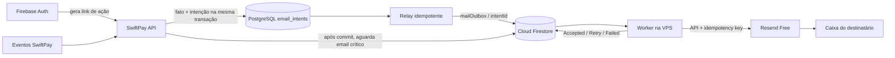

# Plataforma de email Firebase no plano Spark

## Status

Arquitetura híbrida atômica aprovada no gate CEO; implementação e deploy ainda não iniciados.

- Projeto Firebase: `swiftpay-878c0`
- Plano: Spark, sem conta de cobrança
- Firestore: ainda não criado
- Região decidida para o único banco gratuito: `southamerica-east1` (São Paulo)
- Transporte externo: Resend Free, subordinado à outbox Firebase
- Domínio de envio: `swiftpayment.info`, verificado no Resend; propagação pública SPF/DKIM confirmada
- Remetente padrão: `SwiftPay <noreply@swiftpayment.info>`

## Objetivo

Fazer do Firebase a fonte central e durável da execução de todo email da SwiftPay, sem usar Blaze, preservando atomicamente no PostgreSQL a intenção ligada ao negócio e sem permitir falso sucesso quando o transporte recusou a mensagem.



Firebase permanece o principal da execução porque:

1. Firebase Auth cria e valida links de verificação, redefinição de senha e login por email;
2. Firestore é a fonte de verdade do estado de execução e aceite de cada envio;
3. o worker só processa o que existe na outbox Firestore;
4. Resend não recebe chamadas dos endpoints nem decide fluxo de negócio; é somente o transporte final.

### Fronteira transacional aprovada

PostgreSQL registra `email_intents` na mesma transação do usuário, credencial, pagamento ou outro fato que origine o email. O ID da intenção é determinístico e se torna o ID da outbox e a idempotency key do provider.

Um relay idempotente cria `mailOutbox/{intentId}` no Firestore. Repetir o relay com o mesmo payload retorna o mesmo documento; payload diferente para o mesmo ID é conflito. PostgreSQL é a verdade da intenção vinculada ao negócio. Firestore é a verdade principal da execução e do aceite do transporte.

RabbitMQ pode acordar o relay, mas não é fonte de verdade e não é requisito do primeiro corte. Uma varredura de recuperação no PostgreSQL garante que intenção confirmada seja espelhada mesmo após falha ou restart.

### Fronteira Firebase Auth/PostgreSQL

Chamadas externas ao Firebase nunca ocorrem dentro da transação PostgreSQL. No signup, o client cria/autentica a identidade Firebase; a API valida o ID token e resolve dependências externas antes de abrir a transação. Um único commit faz upsert do usuário pelo UID imutável, cria referral/device e demais estruturas obrigatórias e grava a intenção Auth. A intenção contém tipo de ação, UID, email normalizado, continue URL e dados de template, mas ainda não contém link. Rollback não deixa conta SwiftPay parcialmente provisionada nem intenção.

Após o commit, o materializador/relay usa Firebase Admin para gerar o link, renderiza e congela payload e `sendBefore`, e publica a outbox. Falha do PostgreSQL não cria intenção; a identidade Firebase isolada é reconciliada por retry do signup com o mesmo UID. Falha de geração mantém a intenção não publicada para retry. Se o link foi gerado mas ainda não persistido, outro pode substituí-lo porque nenhum email foi enviado. Depois de persistido no Firestore, link e corpo são imutáveis.

Cada ação Auth possui TTL catalogado. `sendBefore` é o menor entre expiração do link e SLA SwiftPay. TTL desconhecido falha fechado como `ConfigurationInvalid`; a implementação deve validar os TTLs reais do Firebase antes do rollout.

## Corte em relação ao fluxo atual

O fluxo atual possui dois caminhos que devem desaparecer:

- frontend chamando `sendEmailVerification` diretamente, que usa templates Google de customização limitada e não envia como `@swiftpayment.info`;
- backend chamando `IResend` dentro de `EmailService.SendAsync`, permitindo que uma falha do provider seja mascarada por uma API desatualizada.

O corte limpo será:

- materializador/relay usa Firebase Admin SDK, depois do commit, para gerar links de ação;
- o template SwiftPay é renderizado e congelado antes da publicação no Firestore;
- `IEmailIntentWriter.Add(...)` anexa a intenção ao mesmo `DbContext` do fato sem chamar `SaveChanges`; o caller faz um commit explícito e recebe um handle tipado, depois relay e worker publicam/processam a outbox;
- somente o worker possui a credencial Resend;
- nenhum endpoint chama Resend diretamente;
- o helper frontend `sendAccountVerificationEmail` e os fallbacks antigos são removidos quando o backend estiver ativo.

Não haverá compatibilidade dupla, fallback silencioso ou alias legado após a migração.

O renderer é puro e separado do transporte: texto recebe HTML encoding por padrão, URLs passam por allowlist de esquema/host e HTML confiável exige tipo explícito sem entrada direta de request. Placeholders ausentes, desconhecidos ou duplicados falham antes da materialização. O cutover elimina o `string.Replace` cru sem reescrever o visual dos templates.

## Classes de entrega

### Crítica

A chamada precisa distinguir aceite pelo provedor, falha e timeout. Sem webhook de entrega, `Accepted` não significa chegada à caixa postal.

Exemplos:

- verificação de email;
- redefinição e alteração de senha;
- confirmação de dispositivo ou operação sensível;
- confirmação de credenciais API;
- mensagens cuja ausência bloqueia a próxima etapa do usuário.

Contrato:

1. grava `email_intent` junto ao fato de negócio e confirma a transação PostgreSQL;
2. relay idempotente cria `mailOutbox/{intentId}`;
3. após o commit, aguarda mudança para `Accepted`, `Failed`, `DeadLetter` ou `DeliveryUnknown`, dentro de timeout curto e configurável;
4. retorna sucesso de aceite somente para `Accepted`;
5. timeout retorna estado explícito `Pending`, nunca sucesso ou entrega confirmada;
6. a mensagem continua no pipeline depois do timeout;
7. endpoints anônimos preservam resposta anti-enumeração; a verdade operacional fica somente no estado interno.

### Não crítica

A chamada confirma persistência durável da intenção na mesma transação PostgreSQL do fato de negócio.

Exemplos:

- notificações informativas;
- resumos;
- alertas que também aparecem no painel;
- mensagens sem efeito de autorização.

Contrato:

1. grava `email_intent`;
2. retorna `Queued` com o ID da intenção;
3. relay e worker processam de forma assíncrona.

A criticidade pertence à definição do template/evento, não ao chamador. Isso evita que dois endpoints deem semânticas diferentes ao mesmo email.

### Contrato dos endpoints

| Estado interno | Email-only autenticado | Fato confirmado | Anônimo |
|---|---|---|---|
| `Queued|Processing|RetryScheduled` | `202`, `emailStatus: Pending`, ID opaco | resposta original + `Pending` | `202` genérico |
| `Accepted` | `202`, `emailStatus: Accepted` | resposta original + `Accepted` | `202` genérico |
| `Failed|DeadLetter` | `503`, `emailStatus: Failed`, código seguro | resposta original + `Failed` | `202` genérico |
| `DeliveryUnknown` | `202`, `emailStatus: Unknown`, ID para reconciliação | resposta original + `Unknown` | `202` genérico |

Estados PostgreSQL pré-outbox:

| Estado | Email-only | Fato confirmado | Anônimo |
|---|---|---|---|
| `PendingMaterialization|Materializing|MaterializationRetry` | `202/Pending` | original + `Pending` | `202` genérico |
| `ReadyToPublish|Publishing|PublishRetry` | `202/Pending` | original + `Pending` | `202` genérico |
| `ConfigurationInvalid|MaterializationFailed|PublishConflict|PublishFailed` | `503/Failed` + código seguro | original + `Failed` | `202` genérico |
| `Published` sem resumo terminal | delega ao Firestore | delega ao Firestore | `202` genérico |
| resumo terminal persistido | usa PostgreSQL sem PII | usa PostgreSQL sem PII | `202` genérico |

Status owner-scoped consulta PostgreSQL antes de `Published`, Firestore durante execução publicada e o resumo terminal PostgreSQL depois do cleanup. Outbox ausente sem resumo vira `Unknown` + alerta, nunca 404 enganoso.

Signup espera até 3s depois do commit e usa o mapeamento de fato confirmado. A espera usa sinal local, sem polling, e no máximo uma releitura owner-scoped perto do deadline; timeout retorna `Pending`. Notificações retornam após commit com `Queued`; consumers não têm contrato HTTP. `GET /v1/email-deliveries/{messageId}` expõe somente estado, código seguro e timestamps ao mesmo owner. Anônimos não recebem handle e mantêm corpo, status, trabalho equivalente, latência mínima e rate limits anti-enumeração.

Manifesto de todos os callers `IEmailService` observados:

Ambas as classes reivindicam slot atômico. `Notification` usa somente o pool geral até 70 e não bloqueia caller; `Critical` pode usar os 30 slots reservados e pode exigir espera.

| Caller | Template(s) | Classe | Dedupe | Política |
|---|---|---|---|---|
| `EvaluateMerchantKycEndpoint` | `KycApproved/Rejected/Complement` | Critical | transition | fato |
| `InactivateMerchantEndpoint`, `SuspendMerchantEndpoint` | `MerchantInactivated/Suspended` | Critical | transition | fato |
| `ResetUserPasswordEndpoint` | `AdminPasswordReset` | Critical | operation | email-only |
| `SendUserEmailConfirmationEndpoint` | `EmailConfirmation` | Critical | operation | email-only |
| `ForgotPasswordEndpoint` | `PasswordReset` | Critical | reset window | anônimo |
| `ResendDeviceCodeEndpoint` | `DeviceVerification` | Critical | cooldown | email-only |
| `ResetPasswordEndpoint` | `PasswordChanged` | Critical | transition | fato |
| `SendEmailConfirmationEndpoint` | `EmailConfirmation` | Critical | verify window | anônimo |
| `SignInEndpoint` | `AccountLocked`, `DeviceVerification` | Critical | transition/cooldown | anônimo Auth |
| `VerifyDeviceEndpoint` | `DeviceAdded` | Critical | transition | fato |
| `CreateCashoutAccountEndpoint` | `PayoutAccountActionVerification` | Critical | transition | fato |
| `RequestCashoutAccountActionEndpoint`, `ResendCashoutVerificationCodeEndpoint` | `PayoutAccountActionVerification` | Critical | cooldown | email-only |
| `VerifyCashoutAccountEndpoint` | `PayoutAccountCreated` | Critical | transition | fato |
| `ConfirmDeleteMerchantEndpoint` | `MerchantDeleted` | Critical | transition | fato |
| `ConfirmCreateApiCredentialEndpoint`, `CreateApiCredentialEndpoint` | `ApiCredentialCreated` | Critical | transition | fato |
| `ConfirmDeleteApiCredentialEndpoint`, `DeleteApiCredentialEndpoint` | `ApiCredentialRevoked` | Critical | transition | fato |
| `ConfirmRegenerateApiCredentialEndpoint` | `ApiCredentialRegenerated` | Critical | transition | fato |
| `RequestCreateApiCredentialEndpoint`, `RequestDeleteApiCredentialEndpoint`, `RequestRegenerateApiCredentialEndpoint` | `ApiCredentialCode` | Critical | cooldown | email-only |
| `SendTestEmailEndpoint` | HTML customizado | Notification | operation | notificação |
| `RequestDeleteMerchantEndpoint` | `MerchantDeletionCode` | Critical | cooldown | email-only |
| `SubmitOnboardingEndpoint` | `KycSubmitted` | Notification | transition | notificação |
| `ChangePasswordEndpoint` | `PasswordChangeCode` | Critical | cooldown | email-only |
| `ConfirmChangePasswordEndpoint` | `PasswordChanged` | Critical | transition | fato |
| `RequestReferralPayoutPixKeyUpdateEndpoint` | `ReferralPayoutPixKeyVerification` | Critical | cooldown | email-only |
| `ProcessCashoutConsumer`, `InternalReprocessCompletedCashoutDevEndpoint` | `PayoutCompleted` | Critical | transition | consumer |
| `CashoutService` | `PayoutRequested`, `PayoutRejected` | Critical | transition | consumer |

Scan de `IEmailService` deve coincidir com o manifesto antes do cutover; caller novo ou ausente bloqueia migração.

## Modelo PostgreSQL da intenção

Tabela: `email_intents`.

Campos mínimos: `Id`, `DedupeKey` único, `RequestHash` imutável, `EnvelopeHash` imutável após materialização, `IntentKind`, `MessageType`, `DeliveryClass`, destinatários, pedido de ação Auth ou inputs, `CreatedAt`, payload/`SendBefore`, estados, tentativas, erros seguros, correlação e referências.

O fato e a intenção compartilham transação. Materializador com compare-and-set cercado gera link, payload, `SendBefore` e `EnvelopeHash` exatamente uma vez; perdedor descarta link não persistido. Relay faz create-only e compara Firestore somente com `EnvelopeHash`. `PublishedAt` só é gravado após confirmar documento equivalente.

Catálogo obrigatório de dedupe:

| Família | Composição |
|---|---|
| transição de negócio | `{messageType}:{aggregateId}:{transitionId}` |
| resumo periódico | `{messageType}:{ownerId}:{periodStartUtc}` |
| ação manual/admin | `{messageType}:{operationId}` |
| verificação de signup | `verify:{firebaseUid}:{signupVersion}` |
| resend de verificação | `verify-resend:{firebaseUid}:{cooldownWindowUtc}` |
| reset de senha | `password-reset:{HMAC(normalizedEmail)}:{cooldownWindowUtc}` |
| verificação de dispositivo | `device-verify:{userId}:{deviceId}:{cooldownWindowUtc}` |
| ação de conta de saque | `cashout-account-action:{merchantId}:{accountOrOperationId}:{action}:{cooldownWindowUtc}` |
| código de credencial API | `api-credential-code:{merchantId}:{credentialOrOperationId}:{action}:{cooldownWindowUtc}` |
| exclusão de merchant | `merchant-delete:{merchantId}:{cooldownWindowUtc}` |
| alteração de senha | `password-change:{userId}:{cooldownWindowUtc}` |
| alteração de chave PIX de indicação | `referral-pix-key:{userId}:{cooldownWindowUtc}` |

Retries reutilizam a chave. `RequestHash` cobre JSON canônico dos inputs imutáveis e detecta colisão da dedupe. `EnvelopeHash` separado cobre destinatário, assunto, corpos, link e `SendBefore` congelados. Mesma chave com `RequestHash` divergente é conflito; materialização nunca altera `RequestHash`.

`cooldownWindowUtc` é persistido na primeira tentativa e nunca recalculado em retry. Recurso opcional usa `operationId` persistido, nunca vazio.

## Modelo Firestore da outbox

Coleção: `mailOutbox`.

Campos mínimos:

| Campo | Tipo | Regra |
|---|---|---|
| `schemaVersion` | integer | começa em `1`; obrigatório |
| `messageType` | string | nome estável do evento/template |
| `deliveryClass` | `Critical` ou `Notification` | definido no catálogo |
| `dedupeKey` | string | chave determinística do evento de negócio |
| `envelopeHash` | string | identifica o envelope final congelado |
| `to` | array de string | endereços normalizados |
| `from` | string | configuração central, não fornecido por cliente |
| `replyTo` | string/null | só usar endereço recebível |
| `subject` | string | congelado antes do enqueue |
| `htmlBody` | string | congelado antes do enqueue |
| `textBody` | string/null | recomendado para acessibilidade e entregabilidade |
| `status` | enum | máquina de estados abaixo |
| `createdAt` | timestamp servidor | imutável |
| `updatedAt` | timestamp servidor | atualizado a cada transição |
| `sendBefore` | timestamp | prazo obrigatório para conteúdo expirável |
| `nextAttemptAt` | timestamp | elegibilidade para tentativa |
| `attemptCount` | integer | incrementado no claim |
| `retryableFailureCount` | integer | não inclui pausa global por quota |
| `ambiguousAttemptCount` | integer | separado de falhas retryable; máximo oito |
| `acceptanceUnknown` | boolean | possível aceite tem precedência sobre expiry/exhaustion |
| `maxRetryableFailures` | integer | configuração por classe |
| `leaseOwner` | string/null | identidade efêmera do worker |
| `leaseToken` | string/null | fencing token renovado a cada claim |
| `leaseUntil` | timestamp/null | permite recuperação após crash |
| `firstProviderAttemptAt` | timestamp/null | persistido antes da primeira chamada externa |
| `idempotencyExpiresAt` | timestamp/null | `firstProviderAttemptAt + 23h`, margem dentro das 24h Resend |
| `quotaReservationDay` | string/null | dia UTC da reserva ativa |
| `quotaReservationClass` | string/null | crítica ou notificação |
| `quotaReservationState` | `Claimed|Released|null` | release por compare-and-set uma vez |
| `providerMessageId` | string/null | ID retornado pelo Resend |
| `providerAcceptedAt` | timestamp/null | aceite confirmado pelo provider |
| `deadLetteredAt` | timestamp/null | preenchido no terminal operacional |
| `lastErrorClass` | string/null | categoria segura, sem segredo/PII |
| `lastErrorCode` | string/null | código seguro do provider |
| `correlationId` | string | correlação com logs e request |
| `userId` | string/null | referência interna, quando aplicável |
| `merchantId` | string/null | referência interna, quando aplicável |

O ID Firestore é a idempotency key Resend. O envelope não muda após materialização; `envelopeHash` rejeita conflito e correções criam outra intenção.

### Máquina de estados

```text
Queued
  -> Processing
  -> Accepted
  -> RetryScheduled -> Processing
  -> Failed
  -> DeadLetter
  -> DeliveryUnknown

Processing com lease vencido -> RetryScheduled ou DeliveryUnknown
```

Transições terminais: `Accepted`, `Failed`, `DeadLetter`, `DeliveryUnknown`.

- `Accepted`: o Resend aceitou o envelope; não afirma entrega na caixa postal.
- `Failed`: erro definitivo conhecido antes do aceite, por exemplo remetente inválido.
- `DeadLetter`: limite de tentativas excedido ou conteúdo expirado (`ContentExpired`).
- `DeliveryUnknown`: o provider pode ter aceitado, mas não foi possível persistir confirmação segura; fora da janela de idempotência, nunca reenviar automaticamente.
- `Pending` é uma resposta de API ao timeout; não é estado persistido da mensagem.

## Algoritmo do worker

1. Listener somente para `Queued`; recovery por minuto para retry vencido e lease expirada.
2. Respeitar `pausedUntil`; quota esgotada pausa globalmente.
3. Precedência de guardas: aceite; resultado pré-aceite explícito; aceite ambíguo; expiração; exaustão.
4. `acceptanceUnknown=true` nunca vira `ContentExpired`/`RetryExhausted`; ao terminar janela, `sendBefore` ou oito ambiguidades, vira `DeliveryUnknown`.
5. Sem ambiguidade, expiração vira `DeadLetter/ContentExpired`.
6. Em transação, revalidar e reutilizar reserva same-day ou reservar no contador `resend-{yyyy-MM-dd}`: 100 total, notificações até 70, 30 críticas.
7. Mensagem guarda dia/classe/estado da reserva; release definitivo pré-aceite é compare-and-set exatamente uma vez. Retry no mesmo dia reutiliza; novo dia reclama slot.
8. Claim grava owner/token, lease 60s e tentativa. Exigir token atual e 20s restantes.
9. Persistir primeira tentativa e expiração +23h antes do Resend; timeout 15s; idempotency key igual ao ID.
10. Aceite retém reserva. Falha permanente libera e vira `Failed`.
11. Falha transitória conhecida libera, incrementa `retryableFailureCount` e agenda base 15s, fator 2, teto 1h, jitter ±20%, máximo oito.
12. Ambiguidade retém reserva e incrementa somente `ambiguousAttemptCount`; retry só dentro de +23h e `sendBefore`.
13. `Retry-After` prevalece; rate limit curto e quota diária são classes distintas.
14. Finalizar somente com mesmo token; lease expirada após possível chamada aplica regra de ambiguidade.

### Concorrência

Múltiplas instâncias podem observar o mesmo snapshot. Só uma vence a transação de claim e reserva. Worker antigo não chama o provider sem token válido nem finaliza sobre sucessor. A idempotência do provider é segunda barreira e não promete exactly-once permanente.


## Índices previstos

Definir somente após validar consultas reais no Emulator Suite ou em um projeto de desenvolvimento:

- `status ASC, nextAttemptAt ASC`;
- `status ASC, leaseUntil ASC`;
- `status ASC, sendBefore ASC`;
- `deliveryClass ASC, status ASC, nextAttemptAt ASC` para reserva de capacidade crítica.

Evitar polling sem candidatos. Uma consulta vazia pode consumir leitura mínima; listener em tempo real atende o caminho normal e a varredura por minuto cobre restart e leases vencidos.

## Segurança

- clientes web não leem nem escrevem `mailOutbox`;
- regras Firestore negam acesso client-side à coleção;
- API, relay e worker usam identidades de serviço separadas;
- API persiste `email_intents` no PostgreSQL e recebe somente leitura Firestore necessária para espera crítica;
- relay recebe leitura da tabela de intenções e permissão Firestore create/get restrita à outbox;
- worker recebe somente permissões Firestore necessárias para consultar e atualizar a outbox;
- alvo: chave Resend `sending_access`, restrita a `swiftpayment.info`, somente no worker/VPS; a chave atual do request path é ampla e deve ser substituída no cutover;
- credenciais Firebase nunca entram no Git, imagem Docker, logs ou documentação;
- logs não incluem token de ação, HTML completo, credenciais, documento pessoal ou endereço completo quando não necessário;
- links de ação são gerados no servidor e possuem validade limitada pelo Firebase.

## Domínio e entregabilidade

O domínio público é `swiftpayment.info`, atualmente servido por Cloudflare DNS.

Estado observado em 2026-08-08:

- API Resend confirmou `swiftpayment.info` `verified`, região `sa-east-1`, sending enabled e receiving disabled;
- DKIM, SPF TXT e MX de return-path aparecem `verified`;
- open/click tracking estão desabilitados;
- TLS está no padrão opportunistic, ainda não enforced;
- nenhum webhook está configurado;
- `_dmarc.swiftpayment.info` e MX de recebimento na raiz continuam ausentes.

Prova ativa:

- `POST /emails` com `SwiftPay <noreply@swiftpayment.info>` para a conta QA retornou ID `ec365e18-c1f9-44fa-bdc7-a43e3ac4231f`;
- `GET /emails/{id}` retornou `last_event=delivered`;
- replay idêntico com a mesma key retornou o mesmo ID e `idempotent-replayed: true`;
- rate limit observado: 10 requests/segundo; headers de uso diário/mensal presentes;
- a chave atual conseguiu listar domains, API keys e webhooks, evidência de privilégio superior a send-only.

Consequências:

- transporte, identidade e idempotência do Resend estão operacionais; durabilidade/outbox/lease/quota 70/30 continuam responsabilidade SwiftPay;
- criar chave `sending_access` restrita ao domínio para o worker e retirar a chave ampla do request path;
- configurar Enforced TLS antes do cutover; falha TLS é falha de transporte observável e links Critical nunca saem sem criptografia;
- criar DMARC inicialmente em observação, validar relatórios e endurecer depois;
- receiving/webhooks permanecem expansões; `suporte@swiftpayment.info` não é `Reply-To` até existir MX recebível.

O certificado HTTPS e o site não são afetados por registros SPF, DKIM, DMARC ou MX.

## Recuperação operacional mínima

O primeiro corte inclui CLI/job somente God na VPS. Exige `messageId`, motivo e evidência; registra ator, horário, estado anterior, consulta ao provider e decisão em auditoria imutável. Para `DeliveryUnknown`, permite confirmar aceite, confirmar não aceite e criar nova intenção com novo `operationId`, ou manter incerteza. A intenção anterior nunca reabre nem reenvia; resultado inconclusivo bloqueia novo envio. A UI administrativa continua adiada.

## Deploy e cutover

O cutover é bloqueado até `.github/workflows/deploy.yml` usar `/root/swiftpay/.env.production`, executar com `set -Eeuo pipefail`, validar health/readiness e fazer rollback explícito em falha. `docker image prune` só roda após confirmação e nunca mascara erro do compose.

A infraestrutura pode ser publicada dormente. O cutover de transporte é único: uma mesma release migra todos os callers, habilita worker/outbox e desabilita/remove Resend direto, sem coexistência que consuma a cota fora do orçamento 70/30. Scan do manifesto, testes completos e gates `/review`, `/qa` e `/ship` precedem a ativação; rollback restaura a release inteira.

## Firebase Auth com domínio SwiftPay

Os emails nativos do Client SDK são enviados pelo Google e têm customização limitada. Para padronizar remetente e template:

1. a API persiste um pedido de ação Auth junto à intenção;
2. materializador/relay usa Firebase Admin SDK, após o commit, para gerar o link;
3. o link entra no template SwiftPay e é congelado na outbox Firestore;
4. o worker envia como `noreply@swiftpayment.info`;
5. o link redireciona para rota HTTPS autorizada da SwiftPay.

A resposta de signup não deve revelar se um endereço já existe. Reenvio precisa de autenticação ou prova equivalente e rate limit por usuário, IP e destino.

## Quotas e retenção

Premissas oficiais observadas:

- Firestore Spark: 50.000 reads/dia, 20.000 writes/dia, 20.000 deletes/dia, 1 GiB e exatamente um banco gratuito por projeto;
- TTL gerenciado requer billing; não será usado;
- Resend Free: 100 emails/dia e 3.000/mês;
- idempotency keys do Resend são mantidas por 24 horas.

Retenção e degradação no Spark:

- payload máximo SwiftPay: 128 KiB; 100/dia por 30 dias representam cerca de 375 MiB brutos antes de overhead;
- cleanup diário no worker, paginado/indexado, em lotes máximos de 200;
- `Accepted`/`Failed`: antes de apagar o documento após 30 dias, persistir idempotentemente no PostgreSQL resumo owner-scoped sem PII; falha no resumo impede delete;
- `DeadLetter`/`DeliveryUnknown`: aos 30 dias persistir o mesmo resumo, apagar destinatário/corpos e manter metadados seguros até 180 dias; depois apagar o documento;
- nunca apagar `Queued`, `Processing` ou `RetryScheduled`;
- alertas de storage/quota em 70%, 85% e 95%; em 85% pausam notificações, em 95% só recuperação crítica;
- quota esgotada pausa processamento Firestore, sem fallback volátil; intenções continuam duráveis no PostgreSQL;
- métricas agregadas vão para logs/telemetria, sem scan completo da coleção.

## Observabilidade

Métricas mínimas:

- tamanho por estado;
- idade da mensagem mais antiga não terminal;
- contagem e taxa de `Accepted`, `Failed`, `DeadLetter`, `DeliveryUnknown` e `ContentExpired`;
- latência enqueue-to-accepted;
- retries por classe de erro;
- consumo diário/mensal estimado do Resend;
- leases expirados;
- timeouts vistos por endpoints críticos.

Alertas:

- primeiro `DeadLetter` ou `DeliveryUnknown`;
- fila crítica acima do limite de idade;
- quota diária em 70%, 85% e 95%;
- sequência de falhas de autenticação do provider;
- listener parado ou recovery scan sem sucesso;
- `pausedUntil` vencido sem retomada.

## Aceite obrigatório

A migração só pode substituir produção depois de provar:

1. signup gera link Firebase e email com remetente `@swiftpayment.info`;
2. link verifica o usuário e o backend sincroniza `EmailVerified`;
3. email transacional real chega à conta QA;
4. endpoint crítico retorna `Accepted`, `Pending` ou falha honesta; nunca afirma entrega em caixa postal;
5. fato de negócio e `email_intent` confirmam ou revertem juntos no PostgreSQL;
6. crash após commit e antes do Firestore é recuperado pelo relay sem perder a intenção;
7. 32 relays/enqueues concorrentes com a mesma `dedupeKey` criam um documento e um envelope;
8. mesma chave com payload diferente é rejeitada;
9. dois workers disputando a mesma mensagem produzem um aceite no provider;
10. worker antigo não finaliza após perder a lease para sucessor;
11. restart antes e depois do claim recupera trabalho elegível;
12. `429` pausa globalmente sem hot loop nem consumir retry count por item;
13. mensagem expirada por `sendBefore` termina `ContentExpired` sem envio;
14. falha após aceite é deduplicada dentro da janela de idempotência;
15. incerteza de aceite além de 24 horas vira `DeliveryUnknown`, sem reenvio automático;
16. listener/recovery ignoram terminais e itens ainda não elegíveis;
17. nenhuma chamada direta ao Resend permanece fora do worker;
18. regras e IAM impedem acesso do cliente à outbox;
19. leitura e escrita projetadas permanecem abaixo das quotas Spark.

## Expansões deliberadamente adiadas

O gate CEO em modo de expansão seletiva manteve o primeiro corte focado. Foram registrados em `TODOS.md`, para fases posteriores:

- webhooks assinados Resend e estados `Delivered`/`Bounced`/`Complained`;
- Cloudflare Email Routing para `suporte@swiftpayment.info`;
- console God/Admin de `DeadLetter` e `DeliveryUnknown`;
- segundo provider e failover baseados em métricas reais;
- preferências e opt-out granular por template.

O primeiro corte também não inclui campanhas, batching, reescrita visual dos templates ou RabbitMQ como fonte de verdade.

## Referências

- [Firebase: gerar links de ação com Admin SDK](https://firebase.google.com/docs/auth/admin/email-action-links)
- [Firestore: preços e quota gratuita](https://firebase.google.com/docs/firestore/pricing)
- [Firestore: transações](https://firebase.google.com/docs/firestore/manage-data/transactions)
- [Resend: SMTP](https://resend.com/docs/send-with-smtp)
- [Resend: idempotency keys](https://resend.com/docs/dashboard/emails/idempotency-keys)
- [Resend: preços](https://resend.com/pricing)
